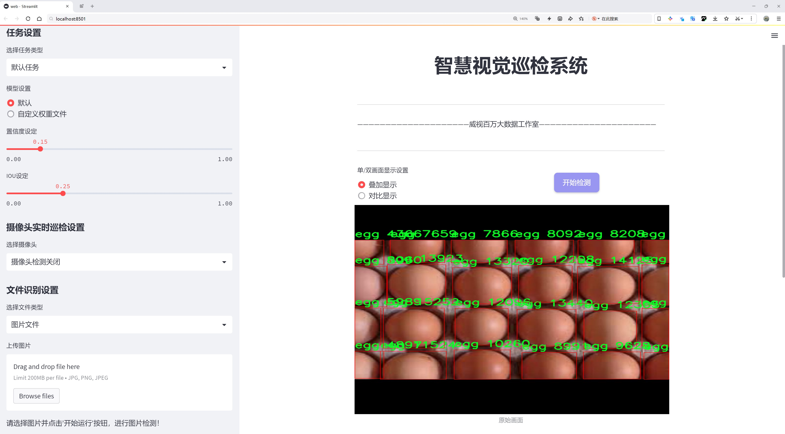
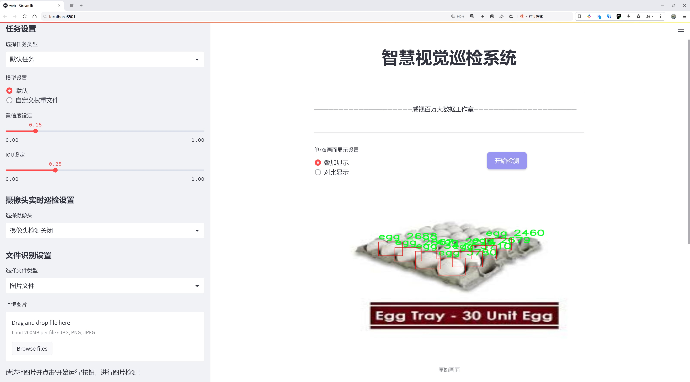
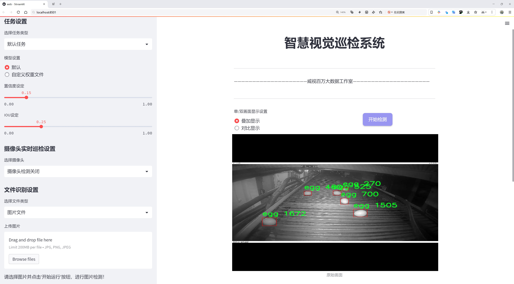
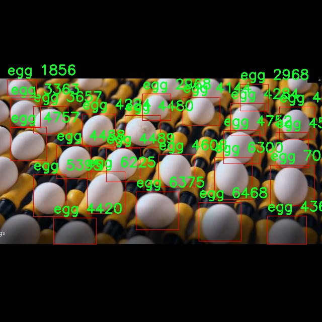
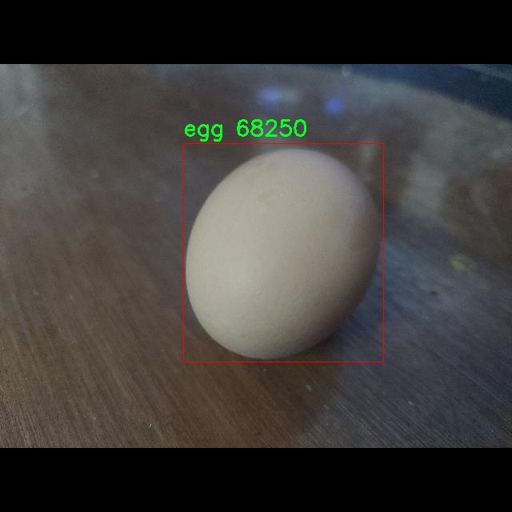
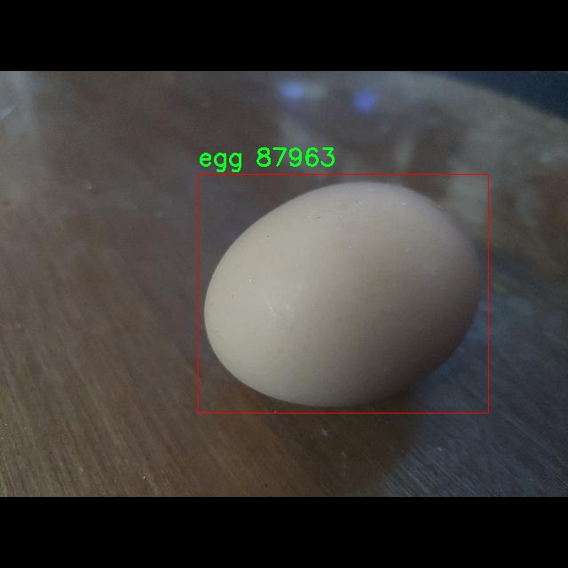
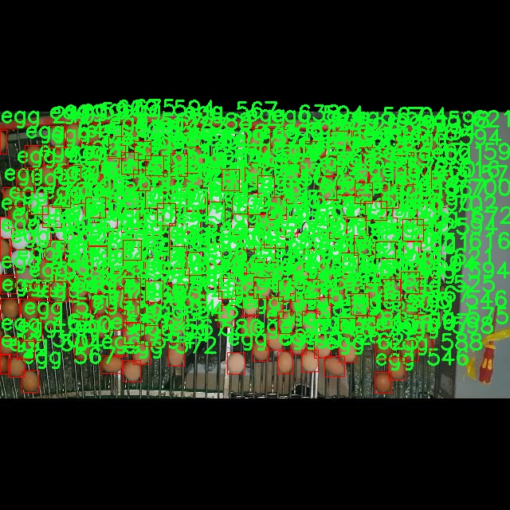

# 设备灰尘检测与分级检测系统源码分享
 # [一条龙教学YOLOV8标注好的数据集一键训练_70+全套改进创新点发刊_Web前端展示]

### 1.研究背景与意义

项目参考[AAAI Association for the Advancement of Artificial Intelligence](https://gitee.com/qunshansj/projects)

项目来源[AACV Association for the Advancement of Computer Vision](https://gitee.com/qunmasj/projects)

研究背景与意义

随着工业化进程的加快和城市化水平的提升，环境污染问题日益严重，尤其是空气中的灰尘颗粒物对人类健康和生态环境造成了显著影响。灰尘不仅影响空气质量，还可能引发一系列健康问题，如呼吸道疾病、过敏反应等。因此，建立有效的灰尘检测与分级系统，能够及时监测和评估环境中的灰尘污染程度，对于保护公众健康和改善生活环境具有重要意义。

近年来，计算机视觉技术的迅猛发展为环境监测提供了新的解决方案。YOLO（You Only Look Once）系列目标检测算法因其高效性和实时性，广泛应用于各类物体检测任务。YOLOv8作为该系列的最新版本，进一步提升了检测精度和速度，适用于复杂环境下的目标识别与分类。基于YOLOv8的设备灰尘检测与分级系统，能够实现对不同类型灰尘的实时监测与分类，为环境管理提供科学依据。

本研究旨在构建一个基于改进YOLOv8的设备灰尘检测与分级系统，利用收集到的2300张图像数据，针对三类灰尘（大灰尘、清洁状态、过滤灰尘）进行训练和测试。通过对数据集的深入分析与处理，结合YOLOv8的强大特性，我们将探索如何优化模型的检测精度与速度，以适应实际应用需求。研究过程中，将重点关注数据集的标注质量和多样性，以确保模型的泛化能力和鲁棒性。

本研究的意义不仅在于技术层面的创新，更在于其对环境保护和公共健康的积极影响。通过建立高效的灰尘检测与分级系统，能够为城市管理者提供实时的环境监测数据，帮助其制定科学的治理措施，减少灰尘污染对居民生活的影响。此外，该系统还可以为工业生产提供参考，帮助企业在生产过程中有效控制灰尘排放，推动绿色生产和可持续发展。

在学术研究方面，本研究将为目标检测领域提供新的应用案例，丰富YOLOv8在环境监测中的应用场景。同时，通过对数据集的构建与优化，探索灰尘检测的特征提取与分类方法，为后续相关研究提供参考与借鉴。总之，基于改进YOLOv8的设备灰尘检测与分级系统，不仅具有重要的理论价值，也具备广泛的应用前景，将为环境保护与公共健康事业做出积极贡献。

### 2.图片演示







##### 注意：由于此博客编辑较早，上面“2.图片演示”和“3.视频演示”展示的系统图片或者视频可能为老版本，新版本在老版本的基础上升级如下：（实际效果以升级的新版本为准）

  （1）适配了YOLOV8的“目标检测”模型和“实例分割”模型，通过加载相应的权重（.pt）文件即可自适应加载模型。

  （2）支持“图片识别”、“视频识别”、“摄像头实时识别”三种识别模式。

  （3）支持“图片识别”、“视频识别”、“摄像头实时识别”三种识别结果保存导出，解决手动导出（容易卡顿出现爆内存）存在的问题，识别完自动保存结果并导出到tempDir中。

  （4）支持Web前端系统中的标题、背景图等自定义修改，后面提供修改教程。

  另外本项目提供训练的数据集和训练教程,暂不提供权重文件（best.pt）,需要您按照教程进行训练后实现图片演示和Web前端界面演示的效果。

### 3.视频演示

[3.1 视频演示](https://www.bilibili.com/video/BV1St4meVEBD/)

### 4.数据集信息展示

##### 4.1 本项目数据集详细数据（类别数＆类别名）

nc: 3
names: ['big-dust', 'clean', 'filter-dust']


##### 4.2 本项目数据集信息介绍

数据集信息展示

在本研究中，我们采用了名为“Dust Labelling Main”的数据集，以支持对设备灰尘检测与分级系统的改进，特别是针对YOLOv8模型的训练。该数据集专门设计用于识别和分类不同类型的灰尘状态，旨在提升设备维护的效率和准确性。数据集包含三种主要类别，分别是“大灰尘”、“干净”和“过滤灰尘”，这些类别的选择不仅反映了设备在不同工作环境下的状态，也为后续的深度学习模型训练提供了丰富的样本。

“大灰尘”类别主要指的是在设备运行过程中可能积聚的较大颗粒灰尘，这些灰尘的存在可能会影响设备的正常运作，甚至导致设备故障。因此，准确识别和分类“大灰尘”是确保设备高效运行的关键。在数据集中，这一类别的样本通常包括在不同光照条件和不同背景下的灰尘图像，旨在提高模型的鲁棒性，使其能够在实际应用中更好地应对各种复杂情况。

“干净”类别则代表设备在最佳工作状态下的图像，通常是没有灰尘或污垢的状态。这一类别的样本对于模型的训练同样至关重要，因为它提供了一个基准状态，使得模型能够更好地学习如何区分正常和异常的工作状态。通过引入“干净”类别，模型不仅能够识别灰尘的存在，还能在实际应用中判断设备是否处于良好的工作状态，从而为维护决策提供依据。

“过滤灰尘”类别则是针对那些经过过滤器处理后的灰尘状态，通常用于监测过滤系统的效率和效果。这一类别的样本展示了在过滤过程中，灰尘的减少程度以及过滤器的工作效果。通过对“过滤灰尘”类别的分析，模型能够帮助工程师判断过滤系统的性能，进而优化设备的维护策略。

整个数据集的构建过程经过精心设计，确保了样本的多样性和代表性。每个类别的样本均经过标注，以便于模型在训练过程中能够准确地学习到不同类别之间的特征差异。此外，数据集还考虑到了不同环境条件下的灰尘表现，涵盖了多种设备类型和工作场景，使得训练出来的模型能够在更广泛的应用场景中发挥作用。

在数据集的使用过程中，我们将采用数据增强技术，以进一步提高模型的泛化能力。通过对原始图像进行旋转、缩放、裁剪等处理，增加样本的多样性，从而使得模型在面对未知数据时能够保持较高的识别准确率。

综上所述，“Dust Labelling Main”数据集为我们改进YOLOv8的设备灰尘检测与分级系统提供了坚实的基础。通过对“大灰尘”、“干净”和“过滤灰尘”三种类别的深入分析与学习，我们期望能够构建出一个高效、准确的灰尘检测模型，为设备的维护和管理提供强有力的支持。










### 5.全套项目环境部署视频教程（零基础手把手教学）

[5.1 环境部署教程链接（零基础手把手教学）](https://www.ixigua.com/7404473917358506534?logTag=c807d0cbc21c0ef59de5)


[5.2 安装Python虚拟环境创建和依赖库安装视频教程链接（零基础手把手教学）](https://www.ixigua.com/7404474678003106304?logTag=1f1041108cd1f708b01a)

### 6.手把手YOLOV8训练视频教程（零基础小白有手就能学会）

[6.1 手把手YOLOV8训练视频教程（零基础小白有手就能学会）](https://www.ixigua.com/7404477157818401292?logTag=d31a2dfd1983c9668658)

### 7.70+种全套YOLOV8创新点代码加载调参视频教程（一键加载写好的改进模型的配置文件）

[7.1 70+种全套YOLOV8创新点代码加载调参视频教程（一键加载写好的改进模型的配置文件）](https://www.ixigua.com/7404478314661806627?logTag=29066f8288e3f4eea3a4)

### 8.70+种全套YOLOV8创新点原理讲解（非科班也可以轻松写刊发刊，V10版本正在科研待更新）

由于篇幅限制，每个创新点的具体原理讲解就不一一展开，具体见下列网址中的创新点对应子项目的技术原理博客网址【Blog】：


[8.1 70+种全套YOLOV8创新点原理讲解链接](https://gitee.com/qunmasj/good)

### 9.系统功能展示（检测对象为举例，实际内容以本项目数据集为准）

图9.1.系统支持检测结果表格显示

  图9.2.系统支持置信度和IOU阈值手动调节

  图9.3.系统支持自定义加载权重文件best.pt(需要你通过步骤5中训练获得)

  图9.4.系统支持摄像头实时识别

  图9.5.系统支持图片识别

  图9.6.系统支持视频识别

  图9.7.系统支持识别结果文件自动保存

  图9.8.系统支持Excel导出检测结果数据


### 10.原始YOLOV8算法原理

原始YOLOv8算法原理

YOLOv8（You Only Look Once version 8）是YOLO系列目标检测算法的最新版本，它在检测精度和速度上均有显著提升，成为计算机视觉领域中一个重要的里程碑。YOLOv8的设计理念依然秉承了YOLO系列的单阶段检测方法，旨在实现实时目标检测的同时，保持高效的计算性能。其网络结构主要由输入层、Backbone（主干网络）、Neck（特征融合网络）和Head（检测模块）四个部分组成，每个部分都在前一版本的基础上进行了优化和改进。

在输入层，YOLOv8采用了一系列图像预处理技术，以确保输入数据的质量和一致性。通过调整图像比例、应用Mosaic数据增强等手段，YOLOv8能够有效提高模型的鲁棒性和泛化能力。然而，考虑到Mosaic增强可能会对数据的真实分布造成一定影响，YOLOv8在训练的最后10个epoch中停止使用该增强方法，以避免模型学习到不良信息。

Backbone部分是YOLOv8的核心特征提取模块，采用了一系列卷积和反卷积层，结合残差连接和瓶颈结构，以提高特征提取的效率和准确性。YOLOv8在这一部分引入了C2f模块，替代了之前版本中的C3模块。C2f模块通过增加跳层连接，增强了梯度流动，确保了信息的有效传递，同时保持了模型的轻量化特性。此外，YOLOv8还保留了快速空间金字塔池化（SPPF）模块，通过不同内核尺寸的池化操作，对特征图进行合并，进一步丰富了特征信息。

Neck部分则采用了多尺度特征融合技术，将来自Backbone不同阶段的特征图进行融合。这一过程通过“双塔结构”实现，结合特征金字塔和路径聚合网络，促进了语义特征和定位特征的有效转移。这种设计不仅增强了网络对不同尺度目标的检测能力，还提高了整体的检测性能和鲁棒性。

在Head部分，YOLOv8引入了解耦头的结构，分别处理类别和位置特征。通过将回归分支和预测分支进行分离，YOLOv8能够更高效地进行目标检测。这种方法的优点在于，分类任务更关注特征图中提取到的特征与已知类别的相似性，而定位任务则侧重于边界框与真实框之间的关系。通过这种结构，YOLOv8在收敛速度和预测精度上均有显著提升。此外，YOLOv8还采用了无锚框结构，直接预测目标的中心位置，并引入了任务对齐学习（TAL）机制，以提高正负样本的区分能力。这一机制通过引入分类分数和IOU的高次幂乘积，进一步优化了模型的损失函数，确保在分类和定位任务中均能取得良好的效果。

YOLOv8的多种网络结构（如YOLOv8n、YOLOv8s、YOLOv8m、YOLOv8l和YOLOv8x）为不同应用场景提供了灵活的选择。这些结构的主要区别在于Backbone的层数和残差块的数量，用户可以根据具体需求选择合适的模型。YOLOv8n作为最小的模型，适合在资源受限的环境中运行，而YOLOv8x则提供了更强大的检测能力，适合于对精度要求较高的应用。

总的来说，YOLOv8在设计上充分考虑了目标检测的实际需求，通过对网络结构的优化和改进，成功实现了高效的特征提取和融合。其在COCO数据集上的表现显示，YOLOv8在同等模型参数下，能够取得更高的mAP（mean Average Precision）值，且推理速度也优于前几代YOLO模型。这使得YOLOv8在实时目标检测任务中展现出极大的潜力，尤其是在需要兼顾速度和准确性的应用场景中，YOLOv8无疑是一个理想的选择。

随着YOLOv8的推出，研究者和开发者们可以在更广泛的领域中应用这一先进的目标检测技术，包括自动驾驶、智能监控、机器人视觉等。未来，YOLOv8的进一步优化和应用将为计算机视觉领域带来更多的创新和发展机会。


### 11.项目核心源码讲解（再也不用担心看不懂代码逻辑）

#### 11.1 code\ultralytics\utils\callbacks\hub.py

以下是对代码的核心部分进行提炼和详细注释的结果：

```python
# Ultralytics YOLO 🚀, AGPL-3.0 license

import json
from time import time
from ultralytics.hub.utils import HUB_WEB_ROOT, PREFIX, events
from ultralytics.utils import LOGGER, SETTINGS

def on_fit_epoch_end(trainer):
    """在每个训练周期结束时上传训练进度指标。"""
    session = getattr(trainer, "hub_session", None)  # 获取训练器的hub会话
    if session:
        # 组合训练损失和指标
        all_plots = {
            **trainer.label_loss_items(trainer.tloss, prefix="train"),  # 获取训练损失项
            **trainer.metrics,  # 获取训练指标
        }
        if trainer.epoch == 0:
            from ultralytics.utils.torch_utils import model_info_for_loggers
            # 如果是第一个周期，添加模型信息
            all_plots = {**all_plots, **model_info_for_loggers(trainer)}

        # 将当前周期的指标以JSON格式存入队列
        session.metrics_queue[trainer.epoch] = json.dumps(all_plots)
        # 检查是否超过上传速率限制
        if time() - session.timers["metrics"] > session.rate_limits["metrics"]:
            session.upload_metrics()  # 上传指标
            session.timers["metrics"] = time()  # 重置计时器
            session.metrics_queue = {}  # 重置队列

def on_model_save(trainer):
    """以速率限制的方式将检查点保存到Ultralytics HUB。"""
    session = getattr(trainer, "hub_session", None)  # 获取训练器的hub会话
    if session:
        is_best = trainer.best_fitness == trainer.fitness  # 判断当前模型是否是最佳模型
        # 检查是否超过上传速率限制
        if time() - session.timers["ckpt"] > session.rate_limits["ckpt"]:
            LOGGER.info(f"{PREFIX}Uploading checkpoint {HUB_WEB_ROOT}/models/{session.model_file}")
            session.upload_model(trainer.epoch, trainer.last, is_best)  # 上传模型
            session.timers["ckpt"] = time()  # 重置计时器

def on_train_end(trainer):
    """在训练结束时将最终模型和指标上传到Ultralytics HUB。"""
    session = getattr(trainer, "hub_session", None)  # 获取训练器的hub会话
    if session:
        LOGGER.info(f"{PREFIX}Syncing final model...")
        # 上传最终模型和指标
        session.upload_model(
            trainer.epoch,
            trainer.best,
            map=trainer.metrics.get("metrics/mAP50-95(B)", 0),
            final=True,
        )
        session.alive = False  # 停止心跳
        LOGGER.info(f"{PREFIX}Done ✅\n" f"{PREFIX}View model at {session.model_url} 🚀")

# 定义回调函数
callbacks = (
    {
        "on_fit_epoch_end": on_fit_epoch_end,  # 训练周期结束时的回调
        "on_model_save": on_model_save,  # 模型保存时的回调
        "on_train_end": on_train_end,  # 训练结束时的回调
    }
    if SETTINGS["hub"] is True  # 如果hub设置为True，则启用回调
    else {}
)
```

### 代码核心部分说明：
1. **on_fit_epoch_end**: 该函数在每个训练周期结束时被调用，用于上传训练进度的指标，包括损失和其他性能指标。它会检查是否超过了上传速率限制，并在需要时进行上传。

2. **on_model_save**: 该函数在模型保存时被调用，负责将当前的模型检查点上传到Ultralytics HUB，并且也会检查上传的速率限制。

3. **on_train_end**: 该函数在训练结束时被调用，负责上传最终的模型和训练指标到Ultralytics HUB，并停止心跳。

4. **callbacks**: 这是一个字典，包含了上述回调函数的映射关系，只有在设置了hub时才会启用这些回调。

这些核心部分确保了在训练过程中，模型的训练进度和最终结果能够及时上传到Ultralytics HUB，以便于后续的分析和使用。

这个文件是Ultralytics YOLO项目中的一个回调函数模块，主要用于在训练过程中与Ultralytics HUB进行交互。文件中定义了一系列回调函数，这些函数在特定的训练事件发生时被调用，以便记录训练进度、上传模型和指标等。

首先，文件导入了一些必要的库和模块，包括`json`和`time`，以及Ultralytics HUB相关的工具和设置。接着，定义了一些回调函数。

`on_pretrain_routine_end`函数在预训练例程结束时被调用。它的主要作用是记录上传速率限制的计时器。通过获取训练器的`hub_session`属性，函数开始记录上传的时间。

`on_fit_epoch_end`函数在每个训练周期结束时被调用，负责上传训练进度的指标。它会收集当前周期的损失和其他指标，并将这些信息存储在一个队列中。如果当前时间与上次上传的时间间隔超过设定的速率限制，函数会调用上传方法，将指标上传到HUB，并重置计时器和队列。

`on_model_save`函数在模型保存时被调用。它负责将检查点上传到Ultralytics HUB，并确保遵循速率限制。函数会检查当前模型是否是最佳模型，并在满足条件时进行上传。

`on_train_end`函数在训练结束时被调用，负责上传最终模型和指标到Ultralytics HUB。它会记录训练结束的日志，并停止心跳信号的发送。

`on_train_start`、`on_val_start`、`on_predict_start`和`on_export_start`函数分别在训练、验证、预测和导出开始时被调用，主要用于执行与这些事件相关的操作。

最后，文件将所有的回调函数组织成一个字典，并根据设置决定是否启用这些回调。这些回调函数的设计使得在训练过程中能够灵活地与Ultralytics HUB进行交互，便于监控和管理模型的训练进度和结果。

#### 11.2 code\ultralytics\models\__init__.py

以下是保留的核心代码部分，并附上详细的中文注释：

```python
# Ultralytics YOLO 🚀, AGPL-3.0 license

# 从当前包中导入 RTDETR、SAM 和 YOLO 类
from .rtdetr import RTDETR  # 导入 RTDETR 类，用于某种目标检测任务
from .sam import SAM        # 导入 SAM 类，可能用于图像分割或相关任务
from .yolo import YOLO      # 导入 YOLO 类，通常用于实时目标检测

# 定义模块的公开接口，允许用户更简单地导入这些类
__all__ = "YOLO", "RTDETR", "SAM"  # 这将使得从该模块导入时，只能访问 YOLO、RTDETR 和 SAM
```

### 注释说明：
1. **导入模块**：使用 `from .module import Class` 的方式从当前包中导入所需的类，这种方式确保了代码的模块化和可维护性。
2. **`__all__` 变量**：定义了模块的公共接口，只有在使用 `from module import *` 时，才会导入 `YOLO`、`RTDETR` 和 `SAM` 这三个类。这有助于控制模块的命名空间，避免不必要的名称冲突。

这个程序文件是一个Python模块的初始化文件，文件名为`__init__.py`，通常用于将一个目录标识为一个Python包。在这个文件中，首先有一行注释，表明这个包是与Ultralytics YOLO相关的，并且遵循AGPL-3.0许可证。

接下来，文件通过相对导入的方式引入了三个类或模块：`RTDETR`、`SAM`和`YOLO`。这些类或模块可能分别实现了不同的功能，可能与目标检测、分割或其他计算机视觉任务相关。

最后，`__all__`变量被定义为一个元组，包含了字符串"YOLO"、"RTDETR"和"SAM"。这个变量的作用是控制当使用`from module import *`语句时，哪些名称会被导入。通过定义`__all__`，可以简化导入过程，使得用户在使用这个包时，只需关注这些公开的类或模块。

总体来说，这个文件的主要功能是组织和管理Ultralytics YOLO相关的模块，使得它们可以被方便地导入和使用。

#### 11.3 ui.py

以下是经过简化和注释的核心代码部分：

```python
import sys
import subprocess

def run_script(script_path):
    """
    使用当前 Python 环境运行指定的脚本。

    Args:
        script_path (str): 要运行的脚本路径

    Returns:
        None
    """
    # 获取当前 Python 解释器的路径
    python_path = sys.executable

    # 构建运行命令，使用 streamlit 运行指定的脚本
    command = f'"{python_path}" -m streamlit run "{script_path}"'

    # 执行命令，并等待其完成
    result = subprocess.run(command, shell=True)
    
    # 检查命令执行的返回码，如果不为0则表示出错
    if result.returncode != 0:
        print("脚本运行出错。")

# 主程序入口
if __name__ == "__main__":
    # 指定要运行的脚本路径
    script_path = "web.py"  # 这里可以直接指定脚本名

    # 调用函数运行脚本
    run_script(script_path)
```

### 代码注释说明：
1. **导入模块**：
   - `sys`：用于获取当前 Python 解释器的路径。
   - `subprocess`：用于执行外部命令。

2. **`run_script` 函数**：
   - 定义了一个函数，用于运行指定路径的 Python 脚本。
   - `script_path` 参数是要运行的脚本的路径。

3. **获取 Python 解释器路径**：
   - 使用 `sys.executable` 获取当前 Python 解释器的完整路径。

4. **构建命令**：
   - 使用 f-string 构建命令字符串，调用 `streamlit` 模块来运行指定的脚本。

5. **执行命令**：
   - 使用 `subprocess.run` 执行构建的命令，并等待其完成。

6. **检查返回码**：
   - 如果返回码不为0，表示脚本运行出错，打印错误信息。

7. **主程序入口**：
   - 使用 `if __name__ == "__main__":` 确保代码只在直接运行时执行。
   - 指定要运行的脚本路径，并调用 `run_script` 函数。

这个程序文件名为 `ui.py`，其主要功能是使用当前的 Python 环境来运行一个指定的脚本，具体是通过 Streamlit 框架来启动一个 Web 应用。

首先，程序导入了几个必要的模块，包括 `sys`、`os` 和 `subprocess`。其中，`sys` 模块用于访问与 Python 解释器相关的变量和函数，`os` 模块提供了与操作系统交互的功能，而 `subprocess` 模块则用于执行外部命令。

接着，程序从 `QtFusion.path` 模块中导入了 `abs_path` 函数，这个函数的作用是获取文件的绝对路径。

在 `run_script` 函数中，程序接收一个参数 `script_path`，表示要运行的脚本的路径。函数内部首先获取当前 Python 解释器的路径，接着构建一个命令字符串，这个命令是用来运行指定的脚本，具体使用了 Streamlit 的 `run` 命令。然后，程序通过 `subprocess.run` 方法执行这个命令。如果命令执行后返回的状态码不为零，说明脚本运行出错，程序会输出一条错误信息。

在文件的最后部分，程序通过 `if __name__ == "__main__":` 语句来判断当前模块是否是主程序。若是，程序会指定要运行的脚本路径，这里是通过 `abs_path` 函数获取 `web.py` 的绝对路径。最后，调用 `run_script` 函数来执行这个脚本。

总体来说，这个程序的目的是为了方便地启动一个基于 Streamlit 的 Web 应用，用户只需指定脚本路径，程序就会处理其余的细节。

#### 11.4 code\ultralytics\nn\modules\utils.py

以下是代码中最核心的部分，并附上详细的中文注释：

```python
import torch
import torch.nn.functional as F

def multi_scale_deformable_attn_pytorch(
    value: torch.Tensor,
    value_spatial_shapes: torch.Tensor,
    sampling_locations: torch.Tensor,
    attention_weights: torch.Tensor,
) -> torch.Tensor:
    """
    多尺度可变形注意力机制。

    参数:
        value: 输入特征图，形状为 (batch_size, channels, num_heads, embed_dims)
        value_spatial_shapes: 特征图的空间形状，形状为 (num_levels, 2)
        sampling_locations: 采样位置，形状为 (batch_size, num_queries, num_heads, num_levels, num_points, 2)
        attention_weights: 注意力权重，形状为 (batch_size, num_heads, num_queries, num_levels, num_points)

    返回:
        output: 经过多尺度可变形注意力机制处理后的输出，形状为 (batch_size, num_queries, num_heads * embed_dims)
    """

    # 获取输入的维度信息
    bs, _, num_heads, embed_dims = value.shape  # bs: batch size
    _, num_queries, _, num_levels, num_points, _ = sampling_locations.shape

    # 将输入特征图根据空间形状拆分成多个特征图
    value_list = value.split([H_ * W_ for H_, W_ in value_spatial_shapes], dim=1)

    # 将采样位置进行归一化处理
    sampling_grids = 2 * sampling_locations - 1
    sampling_value_list = []

    # 遍历每个尺度的特征图
    for level, (H_, W_) in enumerate(value_spatial_shapes):
        # 对特征图进行形状变换以适应后续的采样操作
        value_l_ = value_list[level].flatten(2).transpose(1, 2).reshape(bs * num_heads, embed_dims, H_, W_)

        # 获取当前尺度的采样网格
        sampling_grid_l_ = sampling_grids[:, :, :, level].transpose(1, 2).flatten(0, 1)

        # 使用双线性插值对特征图进行采样
        sampling_value_l_ = F.grid_sample(
            value_l_, sampling_grid_l_, mode="bilinear", padding_mode="zeros", align_corners=False
        )
        sampling_value_list.append(sampling_value_l_)

    # 处理注意力权重的形状
    attention_weights = attention_weights.transpose(1, 2).reshape(
        bs * num_heads, 1, num_queries, num_levels * num_points
    )

    # 计算最终的输出
    output = (
        (torch.stack(sampling_value_list, dim=-2).flatten(-2) * attention_weights)
        .sum(-1)
        .view(bs, num_heads * embed_dims, num_queries)
    )

    # 返回输出，调整维度顺序以符合要求
    return output.transpose(1, 2).contiguous()
```

### 代码说明：
1. **函数定义**：`multi_scale_deformable_attn_pytorch` 是实现多尺度可变形注意力机制的核心函数。
2. **参数说明**：
   - `value`：输入特征图，包含多个头的特征信息。
   - `value_spatial_shapes`：特征图的空间形状，指明每个尺度的高和宽。
   - `sampling_locations`：采样位置，指定在特征图上进行采样的具体位置。
   - `attention_weights`：注意力权重，用于加权不同尺度的采样结果。
3. **处理流程**：
   - 将输入特征图根据空间形状拆分为多个特征图。
   - 归一化采样位置，以适应 `grid_sample` 函数的输入要求。
   - 对每个尺度的特征图进行双线性插值采样，得到采样值。
   - 处理注意力权重的形状，使其与采样值的形状相匹配。
   - 计算最终输出，返回经过注意力机制处理后的特征图。

这个程序文件主要是实现了一些与深度学习模型相关的工具函数，特别是与多尺度可变形注意力机制有关的功能。文件中包含了多个函数，下面逐一进行说明。

首先，导入了一些必要的库，包括 `copy`、`math`、`numpy` 和 `torch` 及其相关模块。这些库提供了深度学习所需的基本功能和数学运算支持。

接下来，定义了一个 `_get_clones` 函数，该函数用于创建给定模块的多个克隆副本，返回一个 `nn.ModuleList`。这个功能在构建模型时非常有用，可以方便地生成多个相同的层。

`bias_init_with_prob` 函数用于根据给定的先验概率初始化卷积或全连接层的偏置值。这个初始化方法通过对数几率转换来计算偏置值，确保模型在训练初期的输出具有一定的概率分布。

`linear_init` 函数用于初始化线性模块的权重和偏置。它使用均匀分布在一个特定的范围内初始化权重，并在存在偏置的情况下同样进行初始化。这种初始化方法有助于加速模型的收敛。

`inverse_sigmoid` 函数计算给定张量的反sigmoid函数。它首先将输入限制在0到1之间，然后计算反sigmoid值。这个函数在一些特定的模型中可能用于处理概率值。

最后，`multi_scale_deformable_attn_pytorch` 函数实现了多尺度可变形注意力机制。该函数接收多个参数，包括值张量、空间形状、采样位置和注意力权重。函数内部首先对输入进行维度分解和重组，然后使用 `F.grid_sample` 函数进行双线性插值，采样出对应的值。最后，通过加权求和的方式计算输出，并返回最终的结果。

总体而言，这个文件提供了一些基础的工具函数，特别是与模型参数初始化和多尺度注意力机制相关的功能，为构建和训练深度学习模型提供了便利。

#### 11.5 code\ultralytics\models\fastsam\val.py

以下是经过简化和注释的核心代码部分：

```python
# 导入必要的模块
from ultralytics.models.yolo.segment import SegmentationValidator
from ultralytics.utils.metrics import SegmentMetrics

class FastSAMValidator(SegmentationValidator):
    """
    自定义验证类，用于快速SAM（Segment Anything Model）分割，
    继承自SegmentationValidator类，专门定制验证过程。
    """

    def __init__(self, dataloader=None, save_dir=None, pbar=None, args=None, _callbacks=None):
        """
        初始化FastSAMValidator类，设置任务为'segment'，并使用SegmentMetrics进行评估。

        参数:
            dataloader (torch.utils.data.DataLoader): 用于验证的数据加载器。
            save_dir (Path, optional): 保存结果的目录。
            pbar (tqdm.tqdm): 显示进度的进度条。
            args (SimpleNamespace): 验证器的配置。
            _callbacks (dict): 存储各种回调函数的字典。

        注意:
            禁用ConfusionMatrix和其他相关指标的绘图，以避免错误。
        """
        # 调用父类的初始化方法
        super().__init__(dataloader, save_dir, pbar, args, _callbacks)
        
        # 设置任务类型为分割
        self.args.task = "segment"
        
        # 禁用绘图功能以避免错误
        self.args.plots = False
        
        # 初始化分割指标
        self.metrics = SegmentMetrics(save_dir=self.save_dir, on_plot=self.on_plot)
```

### 代码注释说明：
1. **导入模块**：引入了`SegmentationValidator`和`SegmentMetrics`，分别用于分割验证和计算分割指标。
2. **类定义**：`FastSAMValidator`类继承自`SegmentationValidator`，用于快速SAM分割的自定义验证。
3. **构造函数**：初始化函数接收多个参数，包括数据加载器、保存目录、进度条、配置参数和回调函数。
4. **父类初始化**：通过`super()`调用父类的构造函数，确保父类的初始化逻辑被执行。
5. **任务设置**：将任务类型设置为“segment”，表示该验证器专注于分割任务。
6. **禁用绘图**：为了避免在验证过程中出现错误，禁用了绘图功能。
7. **指标初始化**：使用`SegmentMetrics`初始化分割指标，便于后续的性能评估。

这个程序文件是一个用于快速分割模型（Fast SAM）的验证类，属于Ultralytics YOLO框架的一部分。它继承自`SegmentationValidator`类，主要用于定制化快速SAM的验证过程。该类的主要功能是设置任务为“分割”，并使用`SegmentMetrics`进行评估。此外，为了避免在验证过程中出现错误，该类禁用了绘图功能。

在类的初始化方法中，接收多个参数，包括数据加载器、结果保存目录、进度条、配置参数以及回调函数的字典。初始化时调用了父类的构造函数，并将任务类型设置为“segment”。同时，将绘图功能设置为禁用，以避免与混淆矩阵和其他相关指标的绘图相关的错误。最后，实例化了`SegmentMetrics`对象，用于后续的评估工作。

总的来说，这个类的设计旨在为快速SAM模型提供一个简化且高效的验证流程，确保在验证过程中能够准确评估模型的分割性能，而不受绘图功能的干扰。

#### 11.6 train.py

以下是代码中最核心的部分，并附上详细的中文注释：

```python
class DetectionTrainer(BaseTrainer):
    """
    DetectionTrainer类扩展了BaseTrainer类，用于基于检测模型的训练。
    """

    def build_dataset(self, img_path, mode="train", batch=None):
        """
        构建YOLO数据集。

        参数:
            img_path (str): 包含图像的文件夹路径。
            mode (str): 模式，可以是'train'或'val'，用户可以为每种模式自定义不同的数据增强。
            batch (int, optional): 批次大小，仅适用于'rect'模式。默认为None。
        """
        gs = max(int(de_parallel(self.model).stride.max() if self.model else 0), 32)
        return build_yolo_dataset(self.args, img_path, batch, self.data, mode=mode, rect=mode == "val", stride=gs)

    def get_dataloader(self, dataset_path, batch_size=16, rank=0, mode="train"):
        """构造并返回数据加载器。"""
        assert mode in ["train", "val"]  # 确保模式是'train'或'val'
        with torch_distributed_zero_first(rank):  # 仅在DDP情况下初始化数据集*.cache一次
            dataset = self.build_dataset(dataset_path, mode, batch_size)
        shuffle = mode == "train"  # 训练模式下打乱数据
        if getattr(dataset, "rect", False) and shuffle:
            LOGGER.warning("WARNING ⚠️ 'rect=True'与DataLoader的shuffle不兼容，设置shuffle=False")
            shuffle = False
        workers = self.args.workers if mode == "train" else self.args.workers * 2  # 设置工作线程数
        return build_dataloader(dataset, batch_size, workers, shuffle, rank)  # 返回数据加载器

    def preprocess_batch(self, batch):
        """对一批图像进行预处理，包括缩放和转换为浮点数。"""
        batch["img"] = batch["img"].to(self.device, non_blocking=True).float() / 255  # 将图像转换为浮点数并归一化
        if self.args.multi_scale:  # 如果启用多尺度
            imgs = batch["img"]
            sz = (
                random.randrange(self.args.imgsz * 0.5, self.args.imgsz * 1.5 + self.stride)
                // self.stride
                * self.stride
            )  # 随机选择新的尺寸
            sf = sz / max(imgs.shape[2:])  # 计算缩放因子
            if sf != 1:
                ns = [
                    math.ceil(x * sf / self.stride) * self.stride for x in imgs.shape[2:]
                ]  # 计算新的形状
                imgs = nn.functional.interpolate(imgs, size=ns, mode="bilinear", align_corners=False)  # 进行插值
            batch["img"] = imgs  # 更新图像
        return batch

    def set_model_attributes(self):
        """设置模型的属性，包括类别数量和名称。"""
        self.model.nc = self.data["nc"]  # 将类别数量附加到模型
        self.model.names = self.data["names"]  # 将类别名称附加到模型
        self.model.args = self.args  # 将超参数附加到模型

    def get_model(self, cfg=None, weights=None, verbose=True):
        """返回YOLO检测模型。"""
        model = DetectionModel(cfg, nc=self.data["nc"], verbose=verbose and RANK == -1)  # 创建检测模型
        if weights:
            model.load(weights)  # 加载权重
        return model

    def get_validator(self):
        """返回YOLO模型验证器。"""
        self.loss_names = "box_loss", "cls_loss", "dfl_loss"  # 定义损失名称
        return yolo.detect.DetectionValidator(
            self.test_loader, save_dir=self.save_dir, args=copy(self.args), _callbacks=self.callbacks
        )

    def plot_training_samples(self, batch, ni):
        """绘制带有注释的训练样本。"""
        plot_images(
            images=batch["img"],
            batch_idx=batch["batch_idx"],
            cls=batch["cls"].squeeze(-1),
            bboxes=batch["bboxes"],
            paths=batch["im_file"],
            fname=self.save_dir / f"train_batch{ni}.jpg",
            on_plot=self.on_plot,
        )
```

### 代码核心部分解释：
1. **DetectionTrainer类**：这是一个用于训练YOLO检测模型的类，继承自BaseTrainer。
2. **build_dataset方法**：根据给定的图像路径和模式构建YOLO数据集，支持训练和验证模式。
3. **get_dataloader方法**：构造数据加载器，负责数据的加载和预处理。
4. **preprocess_batch方法**：对输入的图像批次进行预处理，包括归一化和可能的缩放。
5. **set_model_attributes方法**：设置模型的类别数量和名称，以便模型能够正确识别目标。
6. **get_model方法**：返回一个YOLO检测模型实例，可以选择加载预训练权重。
7. **get_validator方法**：返回一个用于验证模型性能的验证器。
8. **plot_training_samples方法**：绘制训练样本及其对应的注释，便于可视化训练过程。

这个程序文件 `train.py` 是一个用于训练 YOLO（You Only Look Once）目标检测模型的脚本，继承自 `BaseTrainer` 类。程序中主要包含了数据集构建、数据加载、模型预处理、模型属性设置、模型获取、验证器获取、损失项标记、训练进度字符串生成、训练样本绘制以及绘制训练指标等功能。

首先，`DetectionTrainer` 类的构造函数中，定义了一个用于构建 YOLO 数据集的方法 `build_dataset`，该方法接收图像路径、模式（训练或验证）和批次大小作为参数。它会根据模型的步幅（stride）计算出合适的大小，并调用 `build_yolo_dataset` 函数来创建数据集。

接着，`get_dataloader` 方法用于构建和返回数据加载器。它会根据模式（训练或验证）选择是否打乱数据，并设置工作线程的数量。此方法确保在分布式训练时只初始化数据集一次。

在数据预处理方面，`preprocess_batch` 方法负责将图像批次缩放并转换为浮点数格式。如果启用了多尺度训练，它会随机选择一个新的图像大小并对图像进行插值处理，以适应模型的输入要求。

`set_model_attributes` 方法用于设置模型的属性，包括类别数量和类别名称，以便模型能够正确识别和处理不同的目标。

`get_model` 方法则用于返回一个 YOLO 检测模型实例，并可选择加载预训练权重。

在验证阶段，`get_validator` 方法返回一个用于验证 YOLO 模型的验证器，并定义了损失名称。

损失项的标记通过 `label_loss_items` 方法实现，该方法将损失项转换为字典格式，便于后续的记录和分析。

为了跟踪训练进度，`progress_string` 方法返回一个格式化的字符串，显示当前的训练轮次、GPU 内存使用情况、损失值、实例数量和图像大小等信息。

此外，`plot_training_samples` 方法用于绘制训练样本及其标注，方便可视化训练过程中的数据。`plot_metrics` 方法则从 CSV 文件中绘制训练指标，生成结果图像。最后，`plot_training_labels` 方法创建一个带标签的训练图，展示数据集中所有的边界框和类别信息。

整体而言，这个文件提供了一个完整的训练框架，涵盖了从数据处理到模型训练、验证和结果可视化的各个方面，旨在帮助用户高效地训练 YOLO 模型进行目标检测任务。

### 12.系统整体结构（节选）

### 整体功能和构架概括

Ultralytics YOLO项目是一个用于目标检测和图像分割的深度学习框架，提供了高效的模型训练、验证和推理功能。整个项目的构架分为多个模块，每个模块负责特定的功能。核心功能包括数据处理、模型构建、训练过程管理、验证和结果可视化等。通过回调机制，用户可以在训练过程中监控模型性能并与Ultralytics HUB进行交互。此外，项目还提供了多种工具函数和模块，支持多种深度学习任务，如分类、分割和目标检测。

### 文件功能整理表

| 文件路径                                                                                      | 功能描述                                                                                         |
|-----------------------------------------------------------------------------------------------|--------------------------------------------------------------------------------------------------|
| `code\ultralytics\utils\callbacks\hub.py`                                                    | 定义训练过程中的回调函数，用于与Ultralytics HUB交互，记录训练进度和上传模型指标。                     |
| `code\ultralytics\models\__init__.py`                                                       | 初始化模块，导入YOLO、RTDETR和SAM模型，定义`__all__`以控制导入内容。                              |
| `ui.py`                                                                                      | 启动一个基于Streamlit的Web应用，方便用户与模型进行交互和可视化。                                  |
| `code\ultralytics\nn\modules\utils.py`                                                      | 提供深度学习模型的工具函数，包括模块克隆、参数初始化和多尺度可变形注意力机制的实现。                 |
| `code\ultralytics\models\fastsam\val.py`                                                    | 定义快速分割模型的验证类，专注于分割任务的验证过程，禁用绘图功能以避免错误。                        |
| `train.py`                                                                                    | 实现YOLO模型的训练过程，包括数据集构建、数据加载、模型设置、训练进度跟踪和结果可视化。              |
| `code\ultralytics\models\fastsam\predict.py`                                                | 提供快速分割模型的推理功能，处理输入图像并生成分割结果。                                          |
| `code\ultralytics\engine\trainer.py`                                                         | 定义训练引擎，管理训练过程中的各种操作，如优化器设置、损失计算和模型更新。                          |
| `code\ultralytics\models\sam\__init__.py`                                                   | 初始化SAM模型模块，可能包含与分割相关的类和方法。                                               |
| `code\web.py`                                                                                 | 可能是Web应用的主文件，处理用户请求并返回相应的结果，具体功能取决于项目的设计。                     |
| `70+种YOLOv8算法改进源码大全和调试加载训练教程（非必要）\ultralytics\models\yolo\classify\train.py` | 实现YOLOv8分类模型的训练过程，提供分类任务的训练框架和功能。                                      |
| `code\ultralytics\data\converter.py`                                                         | 提供数据转换功能，将不同格式的数据转换为模型可接受的格式，支持数据预处理和增强。                    |
| `70+种YOLOv8算法改进源码大全和调试加载训练教程（非必要）\ultralytics\models\nas\model.py`   | 实现神经架构搜索（NAS）相关的模型构建和训练功能，可能涉及模型结构的自动优化和选择。                 |

以上表格整理了每个文件的功能，帮助理解Ultralytics YOLO项目的整体架构和各个模块的职责。

注意：由于此博客编辑较早，上面“11.项目核心源码讲解（再也不用担心看不懂代码逻辑）”中部分代码可能会优化升级，仅供参考学习，完整“训练源码”、“Web前端界面”和“70+种创新点源码”以“13.完整训练+Web前端界面+70+种创新点源码、数据集获取”的内容为准。

### 13.完整训练+Web前端界面+70+种创新点源码、数据集获取


# [下载链接：https://mbd.pub/o/bread/ZpuVmZdw](https://mbd.pub/o/bread/ZpuVmZdw)